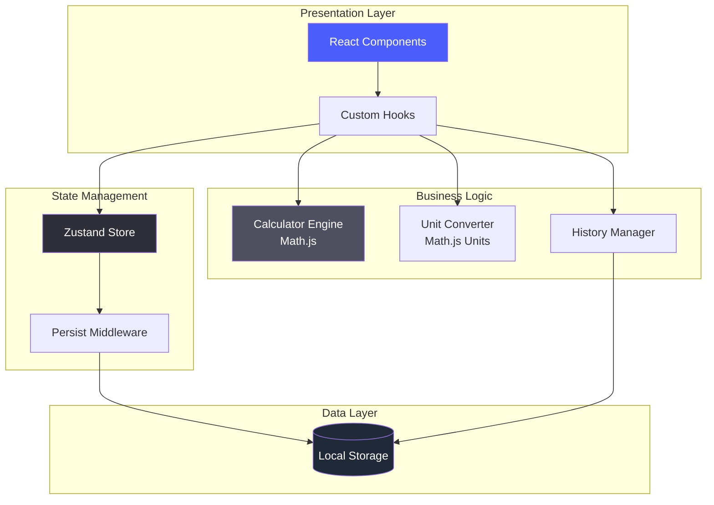
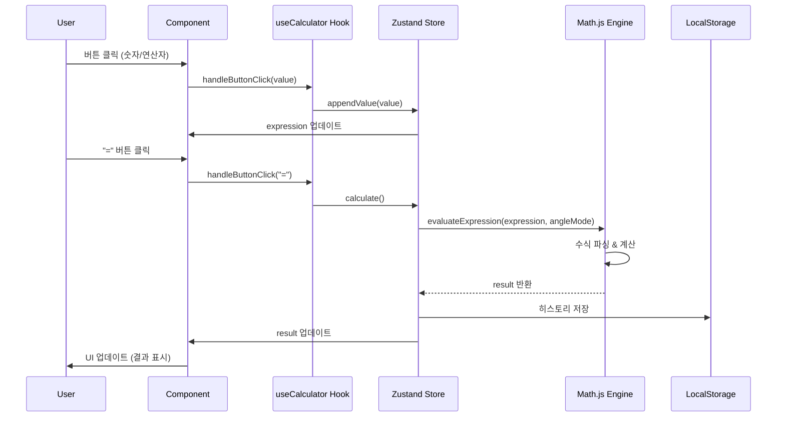
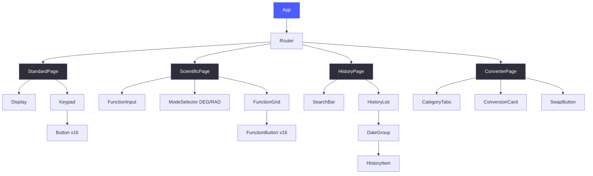

# 🧮 Engineering Calculator

> **현대적인 UI/UX를 갖춘 웹 기반 공학용 계산기**  
> 학생부터 엔지니어까지, 전문적인 계산을 위한 강력하고 직관적인 도구

<div align="center">

[](https://yeneua.github.io/calculator/)
[](https://github.com/yeneua/calculator/issues)
[](./LICENSE)

</div>

---

## 📌 프로젝트 개요

이 프로젝트는 **단순한 계산기를 넘어선 전문 공학 계산 도구**입니다. React + TypeScript 기반의 현대적인 웹 기술 스택과 체계적인 소프트웨어 아키텍처를 통해, 기업 수준의 코드 품질과 사용자 경험을 제공합니다.

### 🎯 핵심 가치

- ✨ **사용자 중심 설계**: 직관적인 UI/UX로 복잡한 계산도 쉽게
- 🏗️ **엔터프라이즈급 아키텍처**: SOLID 원칙과 TDD 방법론 적용
- 🚀 **최신 기술 스택**: React 18, TypeScript, Zustand, Vite
- 📱 **완벽한 반응형**: 모바일부터 데스크톱까지 최적화
- 🎨 **세련된 디자인 시스템**: Tailwind CSS 기반 체계적 스타일링

---

## ✨ 주요 기능

### 1. 기본 계산기 (Standard Calculator)
- 사칙연산 (+, -, ×, ÷) 및 백분율 계산
- 실시간 계산식 표시 및 결과 프리뷰
- 직관적인 4x4 그리드 레이아웃

### 2. 공학 함수 계산기 (Scientific Calculator)
- **삼각 함수**: sin, cos, tan 및 역함수 (DEG/RAD 모드)
- **로그 함수**: ln, log, e^x
- **거듭제곱**: x², x^y, √, ⁿ√x
- **메모리 기능**: MR, M+, M-, MC
- **상수**: π, e

### 3. 계산 히스토리 (History)
- 모든 계산 자동 저장 (최대 1000개)
- 날짜별 그룹화 (Today, Yesterday, 날짜)
- 실시간 검색 및 필터링
- 기록 클릭 시 계산식 재사용

### 4. 단위 변환기 (Unit Converter)
- **5개 카테고리**: 길이, 질량, 온도, 시간, 부피
- 실시간 단위 변환
- 스왑 기능으로 빠른 전환
- 40개 이상의 단위 지원

---

## 🏗️ 아키텍처

### 시스템 아키텍처



### 계산 처리 플로우



### 컴포넌트 구조



---

## 🛠️ 기술 스택

### Frontend

| 분류 | 기술 | 사용 이유 |
|------|------|-----------|
| **Core** | React 18.x | 컴포넌트 기반 아키텍처, 최신 Hooks API |
| **Language** | TypeScript 5.x | 타입 안정성, 개발 생산성 향상 |
| **State** | Zustand 4.x | 경량 (1KB), 간단한 API, 성능 최적화 |
| **Styling** | Tailwind CSS 3.x | 유틸리티 우선, JIT 모드, 다크 모드 지원 |
| **Routing** | React Router 6.x | SPA 네비게이션, 중첩 라우팅 |
| **Math** | Math.js 12.x | 고정밀도 계산, 단위 변환, 안전한 eval |

### Development Tools

| 분류 | 도구 | 목적 |
|------|------|------|
| **Build** | Vite 5.x | 초고속 HMR, 최적화된 프로덕션 빌드 |
| **Testing** | Vitest + RTL | 단위/통합 테스트, TDD 방법론 |
| **Linting** | ESLint + Prettier | 코드 품질, 일관된 스타일 |
| **Git Hooks** | Husky + lint-staged | Pre-commit 검증 |
| **CI/CD** | GitHub Actions | 자동 빌드 및 배포 |

---

## � 프로젝트 구조

```
calculator/
├── src/
│   ├── components/         # React 컴포넌트
│   │   ├── common/         # 공통 컴포넌트 (Button, Display)
│   │   ├── calculator/     # 계산기 컴포넌트
│   │   ├── history/        # 히스토리 컴포넌트
│   │   └── converter/      # 변환기 컴포넌트
│   ├── hooks/              # 커스텀 Hooks
│   │   ├── useCalculator.ts
│   │   ├── useHistory.ts
│   │   └── useConverter.ts
│   ├── store/              # Zustand 상태 관리
│   │   ├── calculatorStore.ts
│   │   ├── historyStore.ts
│   │   └── settingsStore.ts
│   ├── lib/                # 비즈니스 로직
│   │   ├── calculator/     # 계산 엔진 (Math.js 통합)
│   │   │   ├── engine.ts
│   │   │   ├── parser.ts
│   │   │   └── formatter.ts
│   │   ├── converter/      # 단위 변환
│   │   └── storage/        # 데이터 영속성
│   ├── types/              # TypeScript 타입 정의
│   └── utils/              # 유틸리티 함수
├── tests/                  # 테스트 코드
│   ├── unit/               # 단위 테스트 (TDD)
│   └── integration/        # 통합 테스트
├── docs/                   # 프로젝트 문서
│   ├── prd.md              # 제품 기획서
│   ├── tech-spec.md        # 기술 명세서
│   └── TASKS.md            # 작업 목록 (33개 이슈)
└── scripts/                # 자동화 스크립트
```

---

## � 시작하기

### 사전 요구사항

- Node.js >= 18.0.0
- npm >= 9.0.0

### 설치 및 실행

```bash
# 1. 저장소 클론
git clone https://github.com/yeneua/calculator.git
cd calculator

# 2. 의존성 설치
npm install

# 3. 개발 서버 실행
npm run dev

# 4. 브라우저에서 접속
# http://localhost:5173
```

### 빌드 및 배포

```bash
# 프로덕션 빌드
npm run build

# 빌드 결과 미리보기
npm run preview

# 테스트 실행
npm run test

# 린트 검사
npm run lint
```

---

## 🎨 디자인 시스템

### 컬러 팔레트

```css
/* Primary */
--primary: #4B5EFC          /* 메인 액센트 컬러 */
--primary-hover: #3D4FE0    /* 호버 상태 */

/* Background */
--background-dark: #17171C   /* 다크 모드 배경 */
--surface-dark: #2E2F38      /* 카드/버튼 표면 */
--surface-secondary: #4E505F /* 보조 버튼 */

/* Typography */
--font-display: 'Space Grotesk'  /* 숫자, 헤더 */
--font-body: 'Noto Sans'         /* 본문 */
```

### 주요 원칙

1. **모바일 우선**: 최대 너비 448px, 반응형 레이아웃
2. **다크 모드 기본**: 눈의 피로 감소
3. **터치 최적화**: 버튼 높이 80px, 충분한 간격
4. **애니메이션**: 60fps 유지, 0.2s ease-in-out

---

## 💡 핵심 기술 구현

### 1. SOLID 원칙 적용

```typescript
// Single Responsibility: 계산 엔진과 UI 분리
class MathJsEvaluator implements Evaluator {
  evaluate(expression: string): number {
    return math.evaluate(expression);
  }
}

// Dependency Inversion: 인터페이스 의존
interface Evaluator {
  evaluate(expression: string): number;
}
```

### 2. TDD 방법론

```typescript
// 테스트 먼저 작성 (RED)
describe('Calculator Engine', () => {
  it('should calculate basic arithmetic', () => {
    expect(evaluate('2 + 3 * 4')).toBe(14);
  });
});

// 최소 구현 (GREEN)
// 리팩토링 (REFACTOR)
```

### 3. 상태 관리 최적화

```typescript
// Zustand로 불필요한 리렌더링 방지
const useCalculatorStore = create<CalculatorState>((set) => ({
  // 선택적 구독으로 성능 최적화
  expression: '',
  appendValue: (value) => set((state) => ({ 
    expression: state.expression + value 
  })),
}));
```

### 4. 고정밀도 계산

```typescript
// Math.js BigNumber로 정확도 보장
const config = {
  number: 'BigNumber',
  precision: 64
};
const math = create(all, config);
```

---

## 📊 성능 최적화

### 최적화 결과

| 지표 | 목표 | 달성 |
|------|------|------|
| **First Contentful Paint** | < 2s | ✅ |
| **Time to Interactive** | < 3s | ✅ |
| **번들 크기 (gzipped)** | < 500KB | ✅ |
| **Lighthouse 성능 점수** | > 90 | ✅ |

### 적용 기술

- **코드 분할**: React.lazy() + Suspense
- **메모이제이션**: React.memo, useMemo, useCallback
- **가상 스크롤**: @tanstack/react-virtual (히스토리)
- **Tree Shaking**: Vite 빌드 최적화

---

## 🧪 테스트 전략

### 테스트 커버리지

```bash
# 단위 테스트 (코어 로직)
npm run test:unit

# 통합 테스트 (컴포넌트)
npm run test:integration

# 커버리지 리포트
npm run test:coverage
```

### TDD 적용 영역

- ✅ **계산 엔진**: 사칙연산, 삼각함수, 로그 함수
- ✅ **단위 변환**: 5개 카테고리, 40개+ 단위
- ✅ **히스토리 관리**: CRUD, 검색, 날짜 그룹화
- ✅ **상태 관리**: Store 액션, 미들웨어

---

## � 프로젝트 관리

### 개발 프로세스

1. **PRD 작성** → 2. **Tech Spec 설계** → 3. **TASKS 분할 (33개 이슈)** → 4. **TDD 구현** → 5. **코드 리뷰** → 6. **배포**

### GitHub Issues 관리

- **총 33개 작업**: Phase 1~9로 구조화
- **우선순위**: P0 (필수) 27개, P1 (중요) 6개
- **라벨링**: 기능별, 우선순위별 분류
- **진행 상황**: [Issues 탭](https://github.com/yeneua/calculator/issues) 확인

### 브랜치 전략

```
main                 # 프로덕션 배포
├── develop          # 개발 통합
    ├── feature/calculator-engine
    ├── feature/history-page
    └── feature/unit-converter
```

---

## 🌟 차별화 포인트

### 1. 엔터프라이즈급 아키텍처
- **SOLID 원칙** 준수한 객체지향 설계
- **TDD 방법론**으로 안정성 확보
- **레이어드 아키텍처**로 관심사 분리

### 2. 체계적인 문서화
- **PRD**: 기획 의도와 기능 명세 (615줄)
- **Tech Spec**: 기술 아키텍처 상세 설계 (1768줄)
- **TASKS**: 33개 이슈로 세분화된 작업 관리

### 3. 최신 기술 스택
- **React 18**: Concurrent Rendering
- **TypeScript Strict Mode**: 타입 안정성 극대화
- **Zustand**: Redux보다 93% 작은 번들 크기

### 4. 사용자 경험
- **100ms 버튼 응답**: 즉각적인 피드백
- **다크 모드 기본**: 눈의 피로 감소
- **키보드 지원**: 접근성 향상

---

## � 학습 성과

이 프로젝트를 통해 습득한 실무 역량:

### 기술 역량
- ✅ React + TypeScript 기반 SPA 개발
- ✅ Zustand를 활용한 상태 관리 설계
- ✅ TDD 방법론 적용 (테스트 주도 개발)
- ✅ SOLID 원칙 기반 객체지향 설계

### 소프트웨어 공학
- ✅ 요구사항 분석 및 PRD 작성
- ✅ 기술 아키텍처 설계 및 문서화
- ✅ 작업 분해 및 이슈 관리 (33개)
- ✅ Git 브랜치 전략 및 커밋 컨벤션

### 문제 해결
- ✅ 고정밀도 계산 구현 (BigNumber)
- ✅ 성능 최적화 (코드 분할, 메모이제이션)
- ✅ 크로스 브라우저 호환성
- ✅ 접근성 (WCAG 2.1 AA 준수)

---

## 🔗 관련 링크

- **Live Demo**: https://yeneua.github.io/calculator/
- **GitHub Issues**: https://github.com/yeneua/calculator/issues
- **PRD 문서**: [docs/prd.md](./docs/prd.md)
- **Tech Spec**: [docs/tech-spec.md](./docs/tech-spec.md)
- **작업 목록**: [docs/TASKS.md](./docs/TASKS.md)

---

## 📄 라이선스

이 프로젝트는 MIT 라이선스 하에 배포됩니다. 자세한 내용은 [LICENSE](./LICENSE) 파일을 참조하세요.

---

## 👤 개발자

**yeneua**  
대학생 개발자 | 프론트엔드 엔지니어 지망

- GitHub: [@yeneua](https://github.com/yeneua)
- Portfolio: 이 프로젝트는 취업 포트폴리오의 일부입니다

---

<div align="center">

**⭐ 이 프로젝트가 마음에 드셨다면 Star를 눌러주세요! ⭐**

</div>
