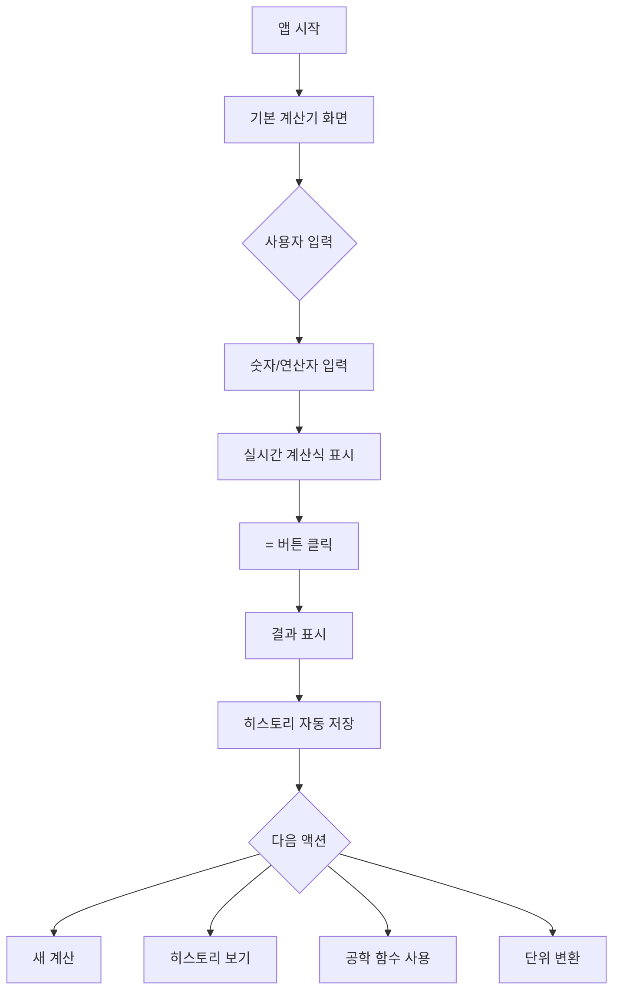

# Product Requirements Document (PRD)
# 공학용 계산기 (Engineering Calculator)

## 1. 프로젝트 개요 (Project Overview)

### 1.1 제품 비전
현대적이고 직관적인 UI/UX를 갖춘 웹 기반 공학용 계산기를 개발하여, 학생, 엔지니어, 연구원 등 전문적인 계산이 필요한 사용자들에게 강력하면서도 사용하기 쉬운 계산 도구를 제공합니다.

### 1.2 목표
- **사용자 경험**: 직관적이고 반응성 높은 인터페이스 제공
- **기능성**: 기본 계산부터 고급 공학 함수까지 포괄적인 계산 기능 지원
- **접근성**: 웹 기반으로 어디서나 접근 가능한 계산기
- **생산성**: 계산 히스토리 및 단위 변환 기능으로 작업 효율성 향상

### 1.3 타겟 사용자
- 공학 전공 학생
- 엔지니어 및 연구원
- 과학 분야 종사자
- 복잡한 수학 계산이 필요한 일반 사용자

---

## 2. 핵심 기능 (Core Features)

### 2.1 기본 계산기 (Standard Calculator)
**화면 구성**:
- 실시간 계산식 표시 (상단)
- 결과값 표시 (대형 폰트)
- 4x4 그리드 버튼 레이아웃

**기능**:
- ✅ 기본 사칙연산 (+, -, ×, ÷)
- ✅ 백분율 계산 (%)
- ✅ 양수/음수 전환 (±)
- ✅ 소수점 입력
- ✅ 전체 삭제 (C)
- ✅ 백스페이스 (한 자리 삭제)
- ✅ 실시간 계산 결과 표시

**UI 특징**:
- 다크 모드 기본 지원
- 숫자 버튼: 어두운 회색 배경 (#2E2F38)
- 연산자 버튼: 프라이머리 블루 (#4B5EFC)
- 기능 버튼: 중간 회색 (#4E505F)
- 버튼 클릭 시 스케일 애니메이션 (0.95)

---

### 2.2 공학 함수 계산기 (Scientific Calculator)
**화면 구성**:
- 상단 네비게이션 (뒤로가기 버튼 + 제목)
- 함수 입력 필드
- 각도 모드 선택 (DEG/RAD)
- 2nd 함수 토글 버튼
- 4x4 함수 버튼 그리드
- Return 버튼 (하단)

**지원 함수**:

#### 삼각 함수
- `sin`, `cos`, `tan`
- `sin⁻¹`, `cos⁻¹`, `tan⁻¹` (2nd 모드)

#### 로그 함수
- `ln` (자연로그)
- `log` (상용로그)
- `eˣ` (자연지수)

#### 거듭제곱 및 루트
- `x²` (제곱)
- `xʸ` (거듭제곱)
- `√` (제곱근)
- `ʸ√x` (n제곱근, 2nd 모드)

#### 기타 함수
- `π` (파이 상수)
- `e` (자연상수)
- `1/x` (역수)
- `x!` (팩토리얼)
- `%` (백분율)
- `(`, `)` (괄호)

#### 메모리 기능
- `MR` (Memory Recall)
- `M+` (Memory Add)
- `M-` (Memory Subtract)
- `MC` (Memory Clear)

**각도 모드**:
- DEG (도): 기본값
- RAD (라디안): 고급 계산용

---

### 2.3 계산 히스토리 (History)
**화면 구성**:
- 상단 헤더 (뒤로가기 + 제목 + Clear 버튼)
- 검색 바 (필터 옵션 포함)
- 날짜별 그룹화된 계산 기록
- 하단 네비게이션 바
- 플로팅 계산기 버튼 (우하단)

**기능**:
- ✅ 모든 계산 기록 자동 저장
- ✅ 날짜별 그룹화 (Today, Yesterday, 날짜)
- ✅ 각 그룹별 항목 수 표시
- ✅ 검색 기능 (계산식 검색)
- ✅ 필터 옵션
- ✅ 기록 클릭 시 재사용
- ✅ 전체 기록 삭제 (Clear All)
- ✅ 계산기로 빠른 이동 (FAB 버튼)

**히스토리 카드 UI**:
- 계산식 표시 (좌측 상단)
- 시간 표시 (우측 상단)
- 결과값 표시 (우측 하단, 프라이머리 컬러)
- 호버 시 화살표 아이콘 표시
- 클릭 시 계산식 재사용

---

### 2.4 단위 변환기 (Unit Converter)
**화면 구성**:
- 상단 네비게이션
- 카테고리 선택 탭 (가로 스크롤)
- 입력 필드 (상단)
- 스왑 버튼 (중앙)
- 결과 필드 (하단)
- 숫자 키패드

**지원 카테고리**:
1. **Length (길이)**
   - Meters, Feet, Inches, Kilometers, Miles, Yards, Centimeters, Millimeters

2. **Mass (질량)**
   - Kilograms, Pounds, Ounces, Grams, Tons, Milligrams

3. **Temperature (온도)**
   - Celsius, Fahrenheit, Kelvin

4. **Time (시간)**
   - Seconds, Minutes, Hours, Days, Weeks, Months, Years

5. **Volume (부피)**
   - Liters, Milliliters, Gallons, Cups, Fluid Ounces, Cubic Meters

**기능**:
- ✅ 실시간 단위 변환
- ✅ 단위 스왑 (입력 ↔ 결과)
- ✅ 복사 기능 (입력/결과값)
- ✅ 카테고리별 빠른 전환
- ✅ 드롭다운으로 단위 선택
- ✅ 계산기 키패드 통합

---

## 3. 디자인 시스템 (Design System)

### 3.1 컬러 팔레트

#### Primary Colors
```css
--primary: #4B5EFC          /* 프라이머리 블루 (버튼, 액센트) */
--primary-hover: #3D4FE0    /* 호버 상태 */
```

#### Background Colors
```css
--background-light: #F6F6F8  /* 라이트 모드 배경 */
--background-dark: #17171C   /* 다크 모드 배경 */
```

#### Surface Colors
```css
--surface-light: #FFFFFF     /* 라이트 모드 카드/버튼 */
--surface-dark: #2E2F38      /* 다크 모드 카드 */
--surface-secondary: #4E505F /* 보조 버튼 */
```

#### Text Colors
```css
--text-primary-light: #1F2937    /* 라이트 모드 텍스트 */
--text-primary-dark: #FFFFFF     /* 다크 모드 텍스트 */
--text-secondary: #64748B        /* 보조 텍스트 */
--text-tertiary: #94A3B8         /* 비활성 텍스트 */
```

### 3.2 타이포그래피

#### Font Families
```css
--font-display: 'Space Grotesk', sans-serif  /* 헤더, 숫자 */
--font-body: 'Noto Sans', sans-serif         /* 본문 */
```

#### Font Sizes
- **Display (결과값)**: 72px (4.5rem), font-weight: 500
- **Large (입력값)**: 48px (3rem), font-weight: 400
- **Heading**: 24px (1.5rem), font-weight: 700
- **Button**: 28px (1.75rem), font-weight: 500
- **Body**: 16px (1rem), font-weight: 400
- **Small**: 12px (0.75rem), font-weight: 500

### 3.3 간격 및 레이아웃

#### Border Radius
```css
--radius-sm: 0.25rem (4px)
--radius-md: 0.5rem (8px)
--radius-lg: 0.75rem (12px)
--radius-xl: 1.5rem (24px)
--radius-2xl: 1.25rem (20px)
--radius-3xl: 1.5rem (24px)
--radius-full: 9999px
```

#### Spacing
- 버튼 간격: 16px (gap-4)
- 섹션 간격: 24px (gap-6)
- 패딩: 16-20px (p-4, p-5)
- 버튼 높이: 80px (h-20) - 기본 계산기
- 버튼 높이: 64px (h-16) - 공학 함수

### 3.4 애니메이션 및 인터랙션

#### Transitions
```css
transition: all 0.2s ease-in-out
```

#### Hover Effects
- 밝기 증가: `brightness-110`
- 배경 변경: `hover:bg-primary/90`
- 스케일: `hover:scale-105`

#### Active States
- 스케일 감소: `active:scale-95`
- 변환 시간: `0.1s`

#### Focus States
- Ring: `focus:ring-2 focus:ring-primary`

---

## 4. 기술 스택 (Technology Stack)

### 4.1 프론트엔드
- **HTML5**: 시맨틱 마크업
- **CSS3**: 
  - Tailwind CSS (유틸리티 우선)
  - 커스텀 CSS 변수
  - 다크 모드 지원
- **JavaScript**: 
  - Vanilla JS 또는 React/Vue
  - 계산 로직
  - 상태 관리

### 4.2 아이콘 및 폰트
- **Google Fonts**: Space Grotesk, Noto Sans
- **Material Symbols**: Outlined 스타일

### 4.3 반응형 디자인
- **모바일 우선**: 최대 너비 448px (max-w-md)
- **뷰포트**: `width=device-width, initial-scale=1.0`
- **최소 높이**: `max(884px, 100dvh)`

---

## 5. 사용자 플로우 (User Flow)

### 5.1 기본 계산 플로우


### 5.2 네비게이션 구조
```
메인 화면 (기본 계산기)
├── 공학 함수 화면
│   └── 뒤로가기 → 메인
├── 히스토리 화면
│   ├── 검색/필터
│   ├── 계산 기록 클릭 → 메인으로 복귀 + 계산식 로드
│   └── 하단 네비게이션
│       ├── Keypad → 메인
│       ├── Sci → 공학 함수
│       ├── History (현재)
│       └── Settings
└── 단위 변환 화면
    └── 뒤로가기 → 메인
```

---

## 6. 기능 요구사항 (Functional Requirements)

### 6.1 계산 엔진
| ID | 요구사항 | 우선순위 |
|----|---------|---------|
| FR-1 | 기본 사칙연산 (+, -, ×, ÷) 지원 | P0 |
| FR-2 | 연산 우선순위 준수 (괄호, 곱셈/나눗셈, 덧셈/뺄셈) | P0 |
| FR-3 | 소수점 계산 정확도 (최소 15자리) | P0 |
| FR-4 | 삼각함수 계산 (sin, cos, tan) | P0 |
| FR-5 | 로그 함수 (ln, log) | P0 |
| FR-6 | 거듭제곱 및 루트 계산 | P0 |
| FR-7 | 각도 모드 전환 (DEG/RAD) | P0 |
| FR-8 | 메모리 기능 (MR, M+, M-, MC) | P1 |
| FR-9 | 2nd 함수 토글 | P1 |
| FR-10 | 오버플로우/언더플로우 에러 처리 | P0 |

### 6.2 히스토리 관리
| ID | 요구사항 | 우선순위 |
|----|---------|---------|
| FR-11 | 모든 계산 자동 저장 (로컬 스토리지) | P0 |
| FR-12 | 날짜별 그룹화 표시 | P0 |
| FR-13 | 계산 기록 검색 기능 | P1 |
| FR-14 | 기록 클릭 시 계산식 재사용 | P0 |
| FR-15 | 전체 히스토리 삭제 | P1 |
| FR-16 | 개별 항목 삭제 (스와이프) | P2 |
| FR-17 | 히스토리 내보내기 (CSV/JSON) | P2 |

### 6.3 단위 변환
| ID | 요구사항 | 우선순위 |
|----|---------|---------|
| FR-18 | 5개 카테고리 지원 (길이, 질량, 온도, 시간, 부피) | P0 |
| FR-19 | 실시간 변환 | P0 |
| FR-20 | 단위 스왑 기능 | P0 |
| FR-21 | 결과값 복사 기능 | P1 |
| FR-22 | 최근 사용 단위 저장 | P2 |

### 6.4 UI/UX
| ID | 요구사항 | 우선순위 |
|----|---------|---------|
| FR-23 | 다크 모드 기본 지원 | P0 |
| FR-24 | 라이트 모드 토글 | P1 |
| FR-25 | 버튼 클릭 피드백 (애니메이션) | P0 |
| FR-26 | 키보드 입력 지원 | P1 |
| FR-27 | 터치 제스처 지원 (스와이프) | P2 |
| FR-28 | 반응형 레이아웃 | P0 |

---

## 7. 비기능 요구사항 (Non-Functional Requirements)

### 7.1 성능
- **응답 시간**: 버튼 클릭 후 100ms 이내 반응
- **계산 속도**: 복잡한 수식도 500ms 이내 결과 표시
- **로딩 시간**: 초기 로딩 2초 이내
- **애니메이션**: 60fps 유지

### 7.2 호환성
- **브라우저**: Chrome 90+, Firefox 88+, Safari 14+, Edge 90+
- **모바일**: iOS 14+, Android 10+
- **화면 크기**: 320px ~ 448px (모바일 최적화)

### 7.3 접근성
- **WCAG 2.1 Level AA** 준수
- **키보드 네비게이션** 완전 지원
- **스크린 리더** 호환
- **색상 대비**: 최소 4.5:1 (텍스트)

### 7.4 보안
- **로컬 스토리지**: 민감 정보 미저장
- **XSS 방지**: 입력값 검증 및 이스케이프
- **CSP**: Content Security Policy 적용

### 7.5 유지보수성
- **코드 구조**: 모듈화된 컴포넌트
- **문서화**: JSDoc 주석
- **테스트**: 단위 테스트 커버리지 80% 이상
- **버전 관리**: Semantic Versioning

---

## 8. 데이터 모델 (Data Model)

### 8.1 계산 히스토리
```typescript
interface CalculationHistory {
  id: string;                    // UUID
  expression: string;            // 계산식 (예: "sin(30) + 5^2")
  result: number | string;       // 결과값
  timestamp: number;             // Unix timestamp
  mode: 'standard' | 'scientific'; // 계산 모드
  angleMode?: 'DEG' | 'RAD';    // 각도 모드 (공학 함수용)
}
```

### 8.2 메모리 상태
```typescript
interface MemoryState {
  value: number;                 // 저장된 값
  lastUpdated: number;           // 마지막 업데이트 시간
}
```

### 8.3 앱 설정
```typescript
interface AppSettings {
  theme: 'light' | 'dark';       // 테마
  angleMode: 'DEG' | 'RAD';      // 기본 각도 모드
  decimalPlaces: number;         // 소수점 자릿수
  historyLimit: number;          // 히스토리 최대 개수
  lastUsedUnits: {               // 마지막 사용 단위
    length: [string, string];
    mass: [string, string];
    temperature: [string, string];
    time: [string, string];
    volume: [string, string];
  };
}
```

---

## 9. 검증 계획 (Verification Plan)

### 9.1 자동화 테스트

#### 단위 테스트
```bash
# 계산 엔진 테스트
npm test -- calculator.test.js

# 테스트 항목:
- 기본 사칙연산 정확도
- 삼각함수 계산 (DEG/RAD)
- 로그 함수
- 거듭제곱 및 루트
- 에러 처리 (0으로 나누기, 오버플로우)
```

#### 통합 테스트
```bash
# UI 컴포넌트 테스트
npm test -- components.test.js

# 테스트 항목:
- 버튼 클릭 이벤트
- 입력값 표시
- 히스토리 저장/불러오기
- 단위 변환 정확도
```

### 9.2 수동 테스트

#### 기능 테스트 체크리스트
- [ ] 기본 계산기 모든 버튼 동작 확인
- [ ] 공학 함수 정확도 검증 (계산기와 비교)
- [ ] 히스토리 저장/검색/삭제 기능
- [ ] 단위 변환 정확도 (5개 카테고리)
- [ ] 다크/라이트 모드 전환
- [ ] 반응형 레이아웃 (다양한 화면 크기)

#### 브라우저 호환성 테스트
- [ ] Chrome (최신 버전)
- [ ] Firefox (최신 버전)
- [ ] Safari (iOS/macOS)
- [ ] Edge (최신 버전)

#### 접근성 테스트
- [ ] 키보드 네비게이션
- [ ] 스크린 리더 (NVDA/JAWS)
- [ ] 색상 대비 검증

---

## 10. 마일스톤 (Milestones)

### Phase 1: 기본 기능 (2주)
- [x] 디자인 시스템 구축
- [ ] 기본 계산기 UI 구현
- [ ] 계산 엔진 개발
- [ ] 로컬 스토리지 연동

### Phase 2: 고급 기능 (2주)
- [ ] 공학 함수 계산기 구현
- [ ] 히스토리 기능 개발
- [ ] 단위 변환기 구현
- [ ] 네비게이션 통합

### Phase 3: 최적화 및 테스트 (1주)
- [ ] 성능 최적화
- [ ] 접근성 개선
- [ ] 크로스 브라우저 테스트
- [ ] 버그 수정

### Phase 4: 배포 (1주)
- [ ] 프로덕션 빌드
- [ ] 문서화 완료
- [ ] 배포 및 모니터링

---

## 11. 성공 지표 (Success Metrics)

### 11.1 사용자 경험
- **첫 화면 로딩 시간**: < 2초
- **버튼 응답 시간**: < 100ms
- **계산 정확도**: 100% (표준 테스트 케이스)

### 11.2 품질
- **테스트 커버리지**: > 80%
- **접근성 점수**: WCAG 2.1 AA 준수
- **성능 점수**: Lighthouse > 90

### 11.3 기술
- **번들 크기**: < 500KB (gzipped)
- **메모리 사용량**: < 50MB
- **배터리 효율**: 최적화된 애니메이션

---

## 12. 향후 개선 사항 (Future Enhancements)

### Phase 5 이후
- [ ] **그래프 기능**: 함수 그래프 시각화
- [ ] **프로그래머 모드**: 2진수, 8진수, 16진수 계산
- [ ] **통계 기능**: 평균, 표준편차, 분산 등
- [ ] **방정식 풀이**: 2차 방정식, 연립방정식
- [ ] **행렬 계산**: 행렬 연산 지원
- [ ] **클라우드 동기화**: 여러 기기 간 히스토리 동기화
- [ ] **테마 커스터마이징**: 사용자 정의 색상
- [ ] **음성 입력**: 음성으로 계산식 입력
- [ ] **위젯**: 홈 화면 위젯 지원
- [ ] **오프라인 PWA**: Progressive Web App 지원

---

## 13. 참고 자료 (References)

### 디자인 파일
- [기본 계산기 화면](file:///c:/Users/yena/Desktop/ai-portfolio-hackathon/calculator/docs/design/stitch_/기본_계산기_화면/screen.png)
- [공학 기능 화면](file:///c:/Users/yena/Desktop/ai-portfolio-hackathon/calculator/docs/design/stitch_/공학_기능_화면/screen.png)
- [히스토리 화면](file:///c:/Users/yena/Desktop/ai-portfolio-hackathon/calculator/docs/design/stitch_/기록/히스토리_화면/screen.png)
- [단위 변환 화면](file:///c:/Users/yena/Desktop/ai-portfolio-hackathon/calculator/docs/design/stitch_/단위_변환_화면/screen.png)

### 기술 문서
- [Tailwind CSS Documentation](https://tailwindcss.com/docs)
- [Material Symbols Guide](https://fonts.google.com/icons)
- [Web Accessibility Guidelines](https://www.w3.org/WAI/WCAG21/quickref/)

---

## 부록 A: 계산 정확도 테스트 케이스

### 기본 연산
```
1,234 + 56 = 1,290 ✓
(125 + 75) / 4 = 50 ✓
√(144) * 2 = 24 ✓
```

### 삼각함수 (DEG 모드)
```
sin(30) = 0.5 ✓
cos(60) = 0.5 ✓
tan(45) = 1 ✓
```

### 로그 함수
```
log(100) = 2 ✓
ln(e) = 1 ✓
```

### 복합 계산
```
sin(30) + 5^2 = 25.5 ✓
π * 4^2 = 50.265 ✓
```

---

## 부록 B: 단위 변환 공식

### 길이 (Length)
```
1 meter = 3.28084 feet
1 meter = 39.3701 inches
1 kilometer = 0.621371 miles
```

### 질량 (Mass)
```
1 kilogram = 2.20462 pounds
1 pound = 16 ounces
```

### 온도 (Temperature)
```
°C = (°F - 32) × 5/9
°F = (°C × 9/5) + 32
K = °C + 273.15
```

---

**문서 버전**: 1.0  
**작성일**: 2025-12-23  
**최종 수정일**: 2025-12-23  
**작성자**: AI Engineering Team
