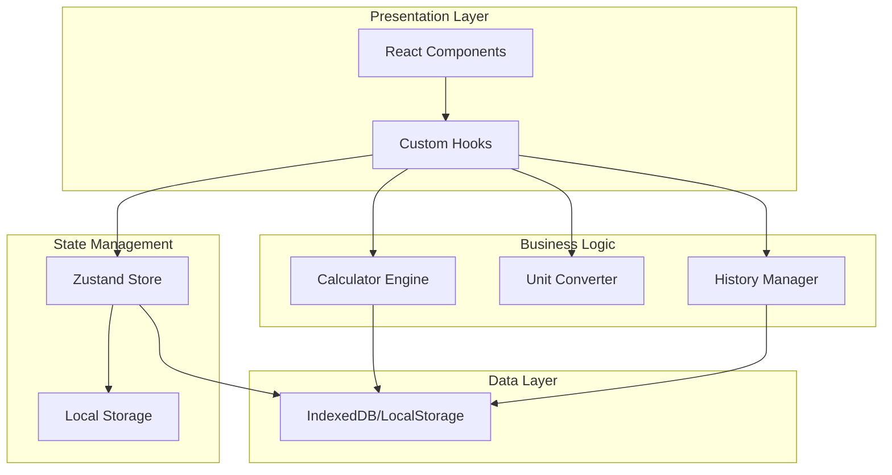
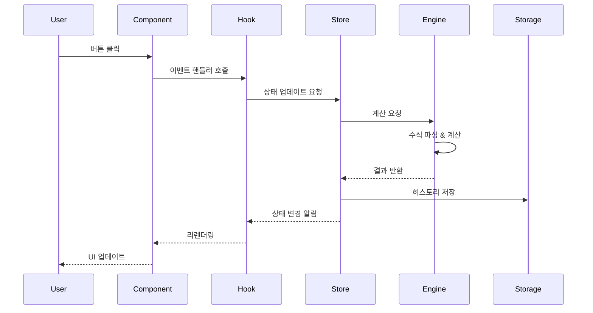

# Technical Specification
# 공학용 계산기 (Engineering Calculator)

**문서 버전**: 1.0  
**작성일**: 2025-12-23  
**관련 문서**: [PRD](./prd.md)

---

## 목차
1. [기술 스택](#1-기술-스택)
2. [아키텍처 설계](#2-아키텍처-설계)
3. [컴포넌트 구조](#3-컴포넌트-구조)
4. [상태 관리](#4-상태-관리)
5. [계산 엔진](#5-계산-엔진)
6. [데이터 영속성](#6-데이터-영속성)
7. [스타일링 시스템](#7-스타일링-시스템)
8. [빌드 및 배포](#8-빌드-및-배포)
9. [테스트 전략](#9-테스트-전략)
10. [성능 최적화](#10-성능-최적화)

---

## 1. 기술 스택

### 1.1 프론트엔드 프레임워크

#### 선택: **React 18.x** + **TypeScript 5.x**

**선정 이유**:
- ✅ 컴포넌트 기반 아키텍처로 재사용성 극대화
- ✅ TypeScript로 타입 안정성 확보
- ✅ React Hooks로 상태 관리 간소화
- ✅ 풍부한 생태계 및 커뮤니티 지원
- ✅ 성능 최적화 도구 (React.memo, useMemo, useCallback)

**대안 고려**:
- Vue 3: 학습 곡선이 낮지만 생태계가 React보다 작음
- Vanilla JS: 번들 크기는 작지만 개발 생산성 저하

### 1.2 빌드 도구

#### 선택: **Vite 5.x**

**선정 이유**:
- ⚡ 빠른 개발 서버 시작 (ESBuild 기반)
- ⚡ HMR (Hot Module Replacement) 속도 우수
- 📦 최적화된 프로덕션 빌드 (Rollup 기반)
- 🔧 간단한 설정
- 📱 PWA 플러그인 지원

**설정**:
```bash
npm create vite@latest calculator -- --template react-ts
```

### 1.3 스타일링

#### 선택: **Tailwind CSS 3.x** + **CSS Modules**

**Tailwind CSS**:
- 유틸리티 우선 접근으로 빠른 개발
- 디자인 시스템과 완벽 호환
- JIT 모드로 번들 크기 최소화
- 다크 모드 기본 지원

**CSS Modules** (복잡한 애니메이션용):
- 스코프 격리
- 커스텀 애니메이션 정의

**Tailwind 설정**:
```typescript
// tailwind.config.ts
export default {
  darkMode: 'class',
  theme: {
    extend: {
      colors: {
        primary: '#4B5EFC',
        'background-light': '#F6F6F8',
        'background-dark': '#17171C',
        'surface-dark': '#2E2F38',
        'surface-secondary': '#4E505F',
      },
      fontFamily: {
        display: ['Space Grotesk', 'sans-serif'],
        sans: ['Noto Sans', 'sans-serif'],
      },
      borderRadius: {
        '3xl': '1.5rem',
      },
    },
  },
}
```

### 1.4 상태 관리

#### 선택: **Zustand 4.x**

**선정 이유**:
- 🪶 경량 (1KB gzipped)
- 🎯 간단한 API
- 🔄 불필요한 리렌더링 최소화
- 💾 로컬 스토리지 미들웨어 내장
- 🧪 테스트 용이

**대안 고려**:
- Redux Toolkit: 보일러플레이트가 많고 과도한 기능
- Context API: 성능 이슈 (모든 컨슈머 리렌더링)
- Jotai/Recoil: 원자 단위 상태는 이 프로젝트에 과도

### 1.5 라우팅

#### 선택: **React Router 6.x**

**선정 이유**:
- 표준 라우팅 라이브러리
- 중첩 라우팅 지원
- 프로그래매틱 네비게이션
- 히스토리 관리

**라우트 구조**:
```
/ (기본 계산기)
/scientific (공학 함수)
/history (히스토리)
/converter (단위 변환)
/settings (설정)
```

### 1.6 계산 엔진

#### 선택: **Math.js 12.x**

**선정 이유**:
- 📐 포괄적인 수학 함수 라이브러리
- 🎯 고정밀도 계산 (BigNumber 지원)
- 📊 단위 변환 내장
- 🔢 복잡한 수식 파싱
- 🛡️ 안전한 eval 대체

**사용 예시**:
```typescript
import { evaluate, unit } from 'mathjs';

// 수식 계산
evaluate('sin(30 deg) + 5^2'); // 25.5

// 단위 변환
unit('1250 m').to('ft'); // 4101.05 ft
```

### 1.7 아이콘 및 폰트

- **아이콘**: Material Symbols (Google Fonts)
- **폰트**: 
  - Space Grotesk (디스플레이)
  - Noto Sans (본문)

### 1.8 테스트

- **단위 테스트**: Vitest 1.x
- **컴포넌트 테스트**: React Testing Library
- **E2E 테스트**: Playwright (선택적)

### 1.9 코드 품질

- **린터**: ESLint 8.x
- **포매터**: Prettier 3.x
- **타입 체크**: TypeScript strict mode
- **Git Hooks**: Husky + lint-staged

---

## 2. 아키텍처 설계

### 2.1 전체 아키텍처



### 2.2 디렉토리 구조

```
calculator/
├── public/
│   ├── favicon.ico
│   └── manifest.json
├── src/
│   ├── assets/
│   │   └── fonts/
│   ├── components/
│   │   ├── common/
│   │   │   ├── Button/
│   │   │   │   ├── Button.tsx
│   │   │   │   ├── Button.module.css
│   │   │   │   └── Button.test.tsx
│   │   │   ├── Display/
│   │   │   └── Icon/
│   │   ├── calculator/
│   │   │   ├── StandardCalculator/
│   │   │   ├── ScientificCalculator/
│   │   │   └── Keypad/
│   │   ├── history/
│   │   │   ├── HistoryList/
│   │   │   ├── HistoryItem/
│   │   │   └── SearchBar/
│   │   └── converter/
│   │       ├── UnitConverter/
│   │       ├── CategoryTabs/
│   │       └── ConversionCard/
│   ├── hooks/
│   │   ├── useCalculator.ts
│   │   ├── useHistory.ts
│   │   ├── useConverter.ts
│   │   └── useTheme.ts
│   ├── store/
│   │   ├── calculatorStore.ts
│   │   ├── historyStore.ts
│   │   ├── settingsStore.ts
│   │   └── index.ts
│   ├── lib/
│   │   ├── calculator/
│   │   │   ├── engine.ts
│   │   │   ├── parser.ts
│   │   │   └── formatter.ts
│   │   ├── converter/
│   │   │   ├── units.ts
│   │   │   └── converter.ts
│   │   └── storage/
│   │       ├── localStorage.ts
│   │       └── indexedDB.ts
│   ├── types/
│   │   ├── calculator.ts
│   │   ├── history.ts
│   │   └── settings.ts
│   ├── utils/
│   │   ├── constants.ts
│   │   ├── helpers.ts
│   │   └── validators.ts
│   ├── pages/
│   │   ├── StandardPage.tsx
│   │   ├── ScientificPage.tsx
│   │   ├── HistoryPage.tsx
│   │   ├── ConverterPage.tsx
│   │   └── SettingsPage.tsx
│   ├── App.tsx
│   ├── main.tsx
│   └── index.css
├── tests/
│   ├── unit/
│   ├── integration/
│   └── e2e/
├── docs/
│   ├── prd.md
│   └── tech-spec.md
├── package.json
├── tsconfig.json
├── vite.config.ts
├── tailwind.config.ts
└── README.md
```

### 2.3 데이터 흐름



---

## 3. 컴포넌트 구조

### 3.1 컴포넌트 계층

```
App
├── Router
│   ├── StandardPage
│   │   ├── Header
│   │   ├── Display
│   │   │   ├── Expression
│   │   │   └── Result
│   │   └── Keypad
│   │       └── Button (x16)
│   ├── ScientificPage
│   │   ├── Header
│   │   ├── FunctionInput
│   │   ├── ModeSelector (DEG/RAD)
│   │   ├── SecondButton
│   │   ├── FunctionGrid
│   │   │   └── FunctionButton (x16)
│   │   └── ReturnButton
│   ├── HistoryPage
│   │   ├── Header
│   │   ├── SearchBar
│   │   ├── HistoryList
│   │   │   ├── DateGroup
│   │   │   │   └── HistoryItem (multiple)
│   │   ├── FAB (Floating Action Button)
│   │   └── BottomNav
│   └── ConverterPage
│       ├── Header
│       ├── CategoryTabs
│       ├── ConversionCard (Input)
│       ├── SwapButton
│       ├── ConversionCard (Result)
│       └── Keypad
└── ThemeProvider
```

### 3.2 주요 컴포넌트 명세

#### 3.2.1 Button Component

```typescript
// src/components/common/Button/Button.tsx
interface ButtonProps {
  variant: 'number' | 'operator' | 'function' | 'special';
  value: string;
  onClick: (value: string) => void;
  disabled?: boolean;
  icon?: string; // Material Symbol name
  className?: string;
}

export const Button: React.FC<ButtonProps> = ({
  variant,
  value,
  onClick,
  disabled = false,
  icon,
  className,
}) => {
  const baseStyles = 'h-20 rounded-3xl font-medium transition-all';
  const variantStyles = {
    number: 'bg-surface-dark text-white hover:bg-surface-dark/80',
    operator: 'bg-primary text-white hover:bg-primary/90',
    function: 'bg-surface-dark text-white hover:brightness-110',
    special: 'bg-surface-secondary text-white hover:brightness-110',
  };

  return (
    <button
      className={cn(baseStyles, variantStyles[variant], className)}
      onClick={() => onClick(value)}
      disabled={disabled}
    >
      {icon ? (
        <span className="material-symbols-outlined">{icon}</span>
      ) : (
        value
      )}
    </button>
  );
};
```

#### 3.2.2 Display Component

```typescript
// src/components/common/Display/Display.tsx
interface DisplayProps {
  expression: string;
  result: string | number;
  error?: string;
}

export const Display: React.FC<DisplayProps> = ({
  expression,
  result,
  error,
}) => {
  return (
    <div className="flex-1 flex flex-col justify-end items-end px-2 mb-8 gap-1">
      <div className="text-gray-400 text-2xl font-light tracking-wide">
        {expression}
      </div>
      <div className="text-7xl font-medium tracking-tight text-white break-all text-right leading-tight">
        {error || formatNumber(result)}
      </div>
    </div>
  );
};
```

#### 3.2.3 HistoryItem Component

```typescript
// src/components/history/HistoryItem/HistoryItem.tsx
interface HistoryItemProps {
  id: string;
  expression: string;
  result: number | string;
  timestamp: number;
  onClick: (id: string) => void;
}

export const HistoryItem: React.FC<HistoryItemProps> = ({
  id,
  expression,
  result,
  timestamp,
  onClick,
}) => {
  return (
    <button
      className="group w-full text-left bg-surface-light dark:bg-surface-dark p-4 rounded-2xl border border-transparent hover:border-primary/50 transition-all shadow-sm hover:shadow-md active:scale-[0.99]"
      onClick={() => onClick(id)}
    >
      <div className="flex flex-col gap-1">
        <div className="flex justify-between items-start">
          <p className="text-slate-800 dark:text-white text-lg font-normal">
            {expression}
          </p>
          <p className="text-slate-400 text-xs font-medium mt-1">
            {formatTime(timestamp)}
          </p>
        </div>
        <div className="flex items-center justify-end mt-1">
          <span className="text-slate-400 text-lg mr-2 font-light">=</span>
          <p className="text-primary text-2xl font-bold">{result}</p>
        </div>
      </div>
    </button>
  );
};
```

---

## 4. 상태 관리

### 4.1 Store 구조

#### 4.1.1 Calculator Store

```typescript
// src/store/calculatorStore.ts
import { create } from 'zustand';
import { persist } from 'zustand/middleware';

interface CalculatorState {
  // State
  expression: string;
  result: number | string;
  memory: number;
  angleMode: 'DEG' | 'RAD';
  secondMode: boolean;
  error: string | null;
  
  // Actions
  appendValue: (value: string) => void;
  calculate: () => void;
  clear: () => void;
  backspace: () => void;
  toggleAngleMode: () => void;
  toggleSecondMode: () => void;
  memoryRecall: () => void;
  memoryAdd: () => void;
  memorySubtract: () => void;
  memoryClear: () => void;
}

export const useCalculatorStore = create<CalculatorState>()(
  persist(
    (set, get) => ({
      expression: '',
      result: 0,
      memory: 0,
      angleMode: 'DEG',
      secondMode: false,
      error: null,
      
      appendValue: (value) => set((state) => ({
        expression: state.expression + value,
      })),
      
      calculate: () => {
        const { expression, angleMode } = get();
        try {
          const result = evaluateExpression(expression, angleMode);
          set({ result, error: null });
          // Save to history
          useHistoryStore.getState().addEntry({
            expression,
            result,
            timestamp: Date.now(),
            mode: 'standard',
            angleMode,
          });
        } catch (error) {
          set({ error: 'Error' });
        }
      },
      
      clear: () => set({ expression: '', result: 0, error: null }),
      
      backspace: () => set((state) => ({
        expression: state.expression.slice(0, -1),
      })),
      
      toggleAngleMode: () => set((state) => ({
        angleMode: state.angleMode === 'DEG' ? 'RAD' : 'DEG',
      })),
      
      toggleSecondMode: () => set((state) => ({
        secondMode: !state.secondMode,
      })),
      
      memoryRecall: () => set((state) => ({
        expression: state.expression + state.memory.toString(),
      })),
      
      memoryAdd: () => set((state) => ({
        memory: state.memory + Number(state.result),
      })),
      
      memorySubtract: () => set((state) => ({
        memory: state.memory - Number(state.result),
      })),
      
      memoryClear: () => set({ memory: 0 }),
    }),
    {
      name: 'calculator-storage',
      partialize: (state) => ({
        memory: state.memory,
        angleMode: state.angleMode,
      }),
    }
  )
);
```

#### 4.1.2 History Store

```typescript
// src/store/historyStore.ts
import { create } from 'zustand';
import { persist } from 'zustand/middleware';

interface HistoryEntry {
  id: string;
  expression: string;
  result: number | string;
  timestamp: number;
  mode: 'standard' | 'scientific';
  angleMode?: 'DEG' | 'RAD';
}

interface HistoryState {
  entries: HistoryEntry[];
  searchQuery: string;
  
  addEntry: (entry: Omit<HistoryEntry, 'id'>) => void;
  removeEntry: (id: string) => void;
  clearAll: () => void;
  setSearchQuery: (query: string) => void;
  getFilteredEntries: () => HistoryEntry[];
}

export const useHistoryStore = create<HistoryState>()(
  persist(
    (set, get) => ({
      entries: [],
      searchQuery: '',
      
      addEntry: (entry) => set((state) => ({
        entries: [
          {
            ...entry,
            id: crypto.randomUUID(),
          },
          ...state.entries,
        ].slice(0, 1000), // Limit to 1000 entries
      })),
      
      removeEntry: (id) => set((state) => ({
        entries: state.entries.filter((e) => e.id !== id),
      })),
      
      clearAll: () => set({ entries: [] }),
      
      setSearchQuery: (query) => set({ searchQuery: query }),
      
      getFilteredEntries: () => {
        const { entries, searchQuery } = get();
        if (!searchQuery) return entries;
        
        return entries.filter((entry) =>
          entry.expression.toLowerCase().includes(searchQuery.toLowerCase())
        );
      },
    }),
    {
      name: 'history-storage',
    }
  )
);
```

#### 4.1.3 Settings Store

```typescript
// src/store/settingsStore.ts
import { create } from 'zustand';
import { persist } from 'zustand/middleware';

interface SettingsState {
  theme: 'light' | 'dark';
  decimalPlaces: number;
  thousandsSeparator: boolean;
  hapticFeedback: boolean;
  soundEnabled: boolean;
  
  setTheme: (theme: 'light' | 'dark') => void;
  setDecimalPlaces: (places: number) => void;
  toggleThousandsSeparator: () => void;
  toggleHapticFeedback: () => void;
  toggleSound: () => void;
}

export const useSettingsStore = create<SettingsState>()(
  persist(
    (set) => ({
      theme: 'dark',
      decimalPlaces: 10,
      thousandsSeparator: true,
      hapticFeedback: true,
      soundEnabled: false,
      
      setTheme: (theme) => {
        set({ theme });
        document.documentElement.classList.toggle('dark', theme === 'dark');
      },
      
      setDecimalPlaces: (places) => set({ decimalPlaces: places }),
      
      toggleThousandsSeparator: () => set((state) => ({
        thousandsSeparator: !state.thousandsSeparator,
      })),
      
      toggleHapticFeedback: () => set((state) => ({
        hapticFeedback: !state.hapticFeedback,
      })),
      
      toggleSound: () => set((state) => ({
        soundEnabled: !state.soundEnabled,
      })),
    }),
    {
      name: 'settings-storage',
    }
  )
);
```

### 4.2 Custom Hooks

#### 4.2.1 useCalculator Hook

```typescript
// src/hooks/useCalculator.ts
import { useCalculatorStore } from '@/store/calculatorStore';
import { useCallback } from 'react';

export const useCalculator = () => {
  const {
    expression,
    result,
    error,
    angleMode,
    secondMode,
    appendValue,
    calculate,
    clear,
    backspace,
    toggleAngleMode,
    toggleSecondMode,
  } = useCalculatorStore();
  
  const handleButtonClick = useCallback((value: string) => {
    switch (value) {
      case '=':
        calculate();
        break;
      case 'C':
        clear();
        break;
      case 'backspace':
        backspace();
        break;
      default:
        appendValue(value);
    }
  }, [calculate, clear, backspace, appendValue]);
  
  return {
    expression,
    result,
    error,
    angleMode,
    secondMode,
    handleButtonClick,
    toggleAngleMode,
    toggleSecondMode,
  };
};
```

---

## 5. 계산 엔진

### 5.1 Math.js 통합

```typescript
// src/lib/calculator/engine.ts
import { create, all, ConfigOptions } from 'mathjs';

const config: ConfigOptions = {
  number: 'BigNumber',
  precision: 64,
};

const math = create(all, config);

export const evaluateExpression = (
  expression: string,
  angleMode: 'DEG' | 'RAD' = 'DEG'
): number | string => {
  try {
    // Convert degrees to radians if needed
    let processedExpression = expression;
    
    if (angleMode === 'DEG') {
      processedExpression = processedExpression
        .replace(/sin\(/g, 'sin((pi/180)*')
        .replace(/cos\(/g, 'cos((pi/180)*')
        .replace(/tan\(/g, 'tan((pi/180)*');
    }
    
    const result = math.evaluate(processedExpression);
    
    // Convert BigNumber to number
    return typeof result === 'object' && result.toNumber
      ? result.toNumber()
      : result;
  } catch (error) {
    throw new Error('Invalid expression');
  }
};
```

### 5.2 수식 파서

```typescript
// src/lib/calculator/parser.ts
export const parseExpression = (expression: string): string[] => {
  // Tokenize expression
  const tokens: string[] = [];
  let currentToken = '';
  
  for (let i = 0; i < expression.length; i++) {
    const char = expression[i];
    
    if (/[0-9.]/.test(char)) {
      currentToken += char;
    } else {
      if (currentToken) {
        tokens.push(currentToken);
        currentToken = '';
      }
      tokens.push(char);
    }
  }
  
  if (currentToken) {
    tokens.push(currentToken);
  }
  
  return tokens;
};
```

### 5.3 숫자 포매터

```typescript
// src/lib/calculator/formatter.ts
export const formatNumber = (
  value: number | string,
  options: {
    decimalPlaces?: number;
    thousandsSeparator?: boolean;
  } = {}
): string => {
  const { decimalPlaces = 10, thousandsSeparator = true } = options;
  
  if (typeof value === 'string') return value;
  
  // Handle special cases
  if (!isFinite(value)) return 'Error';
  if (value === 0) return '0';
  
  // Format number
  let formatted = value.toFixed(decimalPlaces);
  
  // Remove trailing zeros
  formatted = formatted.replace(/\.?0+$/, '');
  
  // Add thousands separator
  if (thousandsSeparator) {
    const parts = formatted.split('.');
    parts[0] = parts[0].replace(/\B(?=(\d{3})+(?!\d))/g, ',');
    formatted = parts.join('.');
  }
  
  return formatted;
};

export const formatTime = (timestamp: number): string => {
  const date = new Date(timestamp);
  const now = new Date();
  
  const isToday = date.toDateString() === now.toDateString();
  const isYesterday = 
    new Date(now.setDate(now.getDate() - 1)).toDateString() === 
    date.toDateString();
  
  const time = date.toLocaleTimeString('en-US', {
    hour: 'numeric',
    minute: '2-digit',
    hour12: true,
  });
  
  if (isToday) return time;
  if (isYesterday) return `Yesterday ${time}`;
  
  return date.toLocaleDateString('en-US', {
    month: 'short',
    day: 'numeric',
    year: 'numeric',
  });
};
```

---

## 6. 데이터 영속성

### 6.1 Local Storage Strategy

```typescript
// src/lib/storage/localStorage.ts
const STORAGE_KEYS = {
  CALCULATOR: 'calculator-storage',
  HISTORY: 'history-storage',
  SETTINGS: 'settings-storage',
} as const;

export const storage = {
  get: <T>(key: string): T | null => {
    try {
      const item = localStorage.getItem(key);
      return item ? JSON.parse(item) : null;
    } catch (error) {
      console.error('Error reading from localStorage:', error);
      return null;
    }
  },
  
  set: <T>(key: string, value: T): void => {
    try {
      localStorage.setItem(key, JSON.stringify(value));
    } catch (error) {
      console.error('Error writing to localStorage:', error);
    }
  },
  
  remove: (key: string): void => {
    try {
      localStorage.removeItem(key);
    } catch (error) {
      console.error('Error removing from localStorage:', error);
    }
  },
  
  clear: (): void => {
    try {
      localStorage.clear();
    } catch (error) {
      console.error('Error clearing localStorage:', error);
    }
  },
};
```

### 6.2 데이터 마이그레이션

```typescript
// src/lib/storage/migration.ts
const CURRENT_VERSION = 1;

interface MigrationConfig {
  version: number;
  migrate: (data: any) => any;
}

const migrations: MigrationConfig[] = [
  {
    version: 1,
    migrate: (data) => {
      // Initial version
      return data;
    },
  },
];

export const migrateData = (data: any, fromVersion: number): any => {
  let migratedData = data;
  
  for (const migration of migrations) {
    if (migration.version > fromVersion) {
      migratedData = migration.migrate(migratedData);
    }
  }
  
  return migratedData;
};
```

---

## 7. 스타일링 시스템

### 7.1 Tailwind 커스텀 플러그인

```typescript
// tailwind.config.ts
import plugin from 'tailwindcss/plugin';

export default {
  // ... other config
  plugins: [
    plugin(({ addUtilities }) => {
      addUtilities({
        '.calc-btn': {
          '@apply transition-transform active:scale-95 duration-100': {},
        },
        '.no-scrollbar': {
          '-ms-overflow-style': 'none',
          'scrollbar-width': 'none',
          '&::-webkit-scrollbar': {
            display: 'none',
          },
        },
      });
    }),
  ],
};
```

### 7.2 CSS 변수 (다크 모드)

```css
/* src/index.css */
@tailwind base;
@tailwind components;
@tailwind utilities;

@layer base {
  :root {
    --color-primary: 75 94 252; /* #4B5EFC */
    --color-background: 246 246 248; /* #F6F6F8 */
    --color-surface: 255 255 255; /* #FFFFFF */
    --color-text: 31 41 55; /* #1F2937 */
  }
  
  .dark {
    --color-background: 23 23 28; /* #17171C */
    --color-surface: 46 47 56; /* #2E2F38 */
    --color-text: 255 255 255; /* #FFFFFF */
  }
  
  body {
    @apply bg-background-light dark:bg-background-dark;
    @apply text-slate-900 dark:text-white;
    @apply font-sans antialiased;
    @apply select-none;
  }
}
```

---

## 8. 빌드 및 배포

### 8.1 Vite 설정

```typescript
// vite.config.ts
import { defineConfig } from 'vite';
import react from '@vitejs/plugin-react';
import { VitePWA } from 'vite-plugin-pwa';
import path from 'path';

export default defineConfig({
  plugins: [
    react(),
    VitePWA({
      registerType: 'autoUpdate',
      manifest: {
        name: 'Engineering Calculator',
        short_name: 'Calculator',
        description: 'Modern engineering calculator with scientific functions',
        theme_color: '#4B5EFC',
        background_color: '#17171C',
        display: 'standalone',
        icons: [
          {
            src: '/icon-192.png',
            sizes: '192x192',
            type: 'image/png',
          },
          {
            src: '/icon-512.png',
            sizes: '512x512',
            type: 'image/png',
          },
        ],
      },
    }),
  ],
  resolve: {
    alias: {
      '@': path.resolve(__dirname, './src'),
    },
  },
  build: {
    target: 'es2020',
    minify: 'terser',
    terserOptions: {
      compress: {
        drop_console: true,
      },
    },
    rollupOptions: {
      output: {
        manualChunks: {
          'react-vendor': ['react', 'react-dom', 'react-router-dom'],
          'math-vendor': ['mathjs'],
        },
      },
    },
  },
});
```

### 8.2 환경 변수

```bash
# .env.development
VITE_APP_NAME=Engineering Calculator
VITE_API_URL=http://localhost:3000
VITE_ENABLE_ANALYTICS=false

# .env.production
VITE_APP_NAME=Engineering Calculator
VITE_API_URL=https://api.calculator.com
VITE_ENABLE_ANALYTICS=true
```

### 8.3 배포 스크립트

```json
// package.json
{
  "scripts": {
    "dev": "vite",
    "build": "tsc && vite build",
    "preview": "vite preview",
    "lint": "eslint . --ext ts,tsx --report-unused-disable-directives --max-warnings 0",
    "format": "prettier --write \"src/**/*.{ts,tsx,css}\"",
    "test": "vitest",
    "test:ui": "vitest --ui",
    "test:coverage": "vitest --coverage",
    "predeploy": "npm run build",
    "deploy": "gh-pages -d dist"
  },
  "devDependencies": {
    "gh-pages": "^6.1.0"
  }
}
```

### 8.4 배포 플랫폼

**선택: GitHub Pages + GitHub Actions**

#### GitHub Actions 워크플로우

```yaml
# .github/workflows/deploy.yml
name: Deploy to GitHub Pages

on:
  push:
    branches:
      - main
  pull_request:
    branches:
      - main

# Sets permissions of the GITHUB_TOKEN to allow deployment to GitHub Pages
permissions:
  contents: read
  pages: write
  id-token: write

# Allow only one concurrent deployment
concurrency:
  group: "pages"
  cancel-in-progress: false

jobs:
  build:
    runs-on: ubuntu-latest
    
    steps:
      - name: Checkout
        uses: actions/checkout@v4
      
      - name: Setup Node.js
        uses: actions/setup-node@v4
        with:
          node-version: '20'
          cache: 'npm'
      
      - name: Install dependencies
        run: npm ci
      
      - name: Run tests
        run: npm run test
      
      - name: Run linter
        run: npm run lint
      
      - name: Build
        run: npm run build
        env:
          VITE_APP_NAME: Engineering Calculator
          VITE_ENABLE_ANALYTICS: true
      
      - name: Setup Pages
        uses: actions/configure-pages@v4
      
      - name: Upload artifact
        uses: actions/upload-pages-artifact@v3
        with:
          path: './dist'
  
  deploy:
    environment:
      name: github-pages
      url: ${{ steps.deployment.outputs.page_url }}
    runs-on: ubuntu-latest
    needs: build
    if: github.ref == 'refs/heads/main'
    
    steps:
      - name: Deploy to GitHub Pages
        id: deployment
        uses: actions/deploy-pages@v4
```

#### Vite 설정 (GitHub Pages용)

```typescript
// vite.config.ts
import { defineConfig } from 'vite';
import react from '@vitejs/plugin-react';
import { VitePWA } from 'vite-plugin-pwa';
import path from 'path';

export default defineConfig({
  // GitHub Pages는 /<repo-name>/ 경로를 사용
  base: process.env.NODE_ENV === 'production' 
    ? '/calculator/' 
    : '/',
  
  plugins: [
    react(),
    VitePWA({
      registerType: 'autoUpdate',
      manifest: {
        name: 'Engineering Calculator',
        short_name: 'Calculator',
        description: 'Modern engineering calculator with scientific functions',
        theme_color: '#4B5EFC',
        background_color: '#17171C',
        display: 'standalone',
        icons: [
          {
            src: '/calculator/icon-192.png',
            sizes: '192x192',
            type: 'image/png',
          },
          {
            src: '/calculator/icon-512.png',
            sizes: '512x512',
            type: 'image/png',
          },
        ],
      },
    }),
  ],
  
  resolve: {
    alias: {
      '@': path.resolve(__dirname, './src'),
    },
  },
  
  build: {
    target: 'es2020',
    minify: 'terser',
    terserOptions: {
      compress: {
        drop_console: true,
      },
    },
    rollupOptions: {
      output: {
        manualChunks: {
          'react-vendor': ['react', 'react-dom', 'react-router-dom'],
          'math-vendor': ['mathjs'],
        },
      },
    },
  },
});
```

#### GitHub Pages 설정

1. **Repository Settings**:
   - Settings → Pages
   - Source: GitHub Actions

2. **Custom Domain (선택사항)**:
   ```
   # public/CNAME
   calculator.yourdomain.com
   ```

3. **404 페이지 (SPA 라우팅)**:
   ```html
   <!-- public/404.html -->
   <!DOCTYPE html>
   <html>
     <head>
       <meta charset="utf-8">
       <title>Calculator</title>
       <script>
         // SPA redirect for GitHub Pages
         sessionStorage.redirect = location.href;
       </script>
       <meta http-equiv="refresh" content="0;URL='/calculator/'">
     </head>
     <body></body>
   </html>
   ```

   ```typescript
   // src/main.tsx - 404 리다이렉트 처리
   const redirect = sessionStorage.redirect;
   delete sessionStorage.redirect;
   if (redirect && redirect !== location.href) {
     history.replaceState(null, '', redirect);
   }
   ```

---

## 9. 테스트 전략

### 9.1 단위 테스트 (Vitest)

```typescript
// src/lib/calculator/engine.test.ts
import { describe, it, expect } from 'vitest';
import { evaluateExpression } from './engine';

describe('Calculator Engine', () => {
  describe('Basic Operations', () => {
    it('should add two numbers', () => {
      expect(evaluateExpression('1234 + 56')).toBe(1290);
    });
    
    it('should multiply and divide', () => {
      expect(evaluateExpression('(125 + 75) / 4')).toBe(50);
    });
    
    it('should handle decimals', () => {
      expect(evaluateExpression('0.1 + 0.2')).toBeCloseTo(0.3);
    });
  });
  
  describe('Scientific Functions', () => {
    it('should calculate sin in DEG mode', () => {
      expect(evaluateExpression('sin(30)', 'DEG')).toBeCloseTo(0.5);
    });
    
    it('should calculate square root', () => {
      expect(evaluateExpression('sqrt(144) * 2')).toBe(24);
    });
    
    it('should calculate power', () => {
      expect(evaluateExpression('5^2')).toBe(25);
    });
  });
  
  describe('Error Handling', () => {
    it('should throw error for invalid expression', () => {
      expect(() => evaluateExpression('1 + + 2')).toThrow();
    });
    
    it('should handle division by zero', () => {
      expect(evaluateExpression('1 / 0')).toBe(Infinity);
    });
  });
});
```

### 9.2 컴포넌트 테스트

```typescript
// src/components/common/Button/Button.test.tsx
import { describe, it, expect, vi } from 'vitest';
import { render, screen, fireEvent } from '@testing-library/react';
import { Button } from './Button';

describe('Button Component', () => {
  it('should render button with value', () => {
    render(<Button variant="number" value="5" onClick={() => {}} />);
    expect(screen.getByText('5')).toBeInTheDocument();
  });
  
  it('should call onClick with value', () => {
    const onClick = vi.fn();
    render(<Button variant="number" value="5" onClick={onClick} />);
    
    fireEvent.click(screen.getByText('5'));
    expect(onClick).toHaveBeenCalledWith('5');
  });
  
  it('should render icon when provided', () => {
    render(
      <Button variant="operator" value="×" onClick={() => {}} icon="close" />
    );
    expect(screen.getByText('close')).toBeInTheDocument();
  });
});
```

### 9.3 통합 테스트

```typescript
// tests/integration/calculator.test.tsx
import { describe, it, expect } from 'vitest';
import { render, screen, fireEvent } from '@testing-library/react';
import { StandardPage } from '@/pages/StandardPage';

describe('Calculator Integration', () => {
  it('should perform basic calculation', () => {
    render(<StandardPage />);
    
    // Click buttons: 1 + 2 =
    fireEvent.click(screen.getByText('1'));
    fireEvent.click(screen.getByText('+'));
    fireEvent.click(screen.getByText('2'));
    fireEvent.click(screen.getByText('='));
    
    // Check result
    expect(screen.getByText('3')).toBeInTheDocument();
  });
});
```

### 9.4 E2E 테스트 (Playwright)

```typescript
// tests/e2e/calculator.spec.ts
import { test, expect } from '@playwright/test';

test.describe('Calculator E2E', () => {
  test('should perform calculation and save to history', async ({ page }) => {
    await page.goto('/');
    
    // Perform calculation
    await page.click('text=1');
    await page.click('text=+');
    await page.click('text=2');
    await page.click('text==');
    
    // Navigate to history
    await page.click('text=History');
    
    // Verify history entry
    await expect(page.locator('text=1 + 2')).toBeVisible();
    await expect(page.locator('text=3')).toBeVisible();
  });
});
```

---

## 10. 성능 최적화

### 10.1 코드 분할

```typescript
// src/App.tsx
import { lazy, Suspense } from 'react';
import { BrowserRouter, Routes, Route } from 'react-router-dom';

const StandardPage = lazy(() => import('@/pages/StandardPage'));
const ScientificPage = lazy(() => import('@/pages/ScientificPage'));
const HistoryPage = lazy(() => import('@/pages/HistoryPage'));
const ConverterPage = lazy(() => import('@/pages/ConverterPage'));

function App() {
  return (
    <BrowserRouter>
      <Suspense fallback={<LoadingSpinner />}>
        <Routes>
          <Route path="/" element={<StandardPage />} />
          <Route path="/scientific" element={<ScientificPage />} />
          <Route path="/history" element={<HistoryPage />} />
          <Route path="/converter" element={<ConverterPage />} />
        </Routes>
      </Suspense>
    </BrowserRouter>
  );
}
```

### 10.2 메모이제이션

```typescript
// src/components/calculator/Keypad/Keypad.tsx
import { memo, useCallback } from 'react';

export const Keypad = memo(({ onButtonClick }: KeypadProps) => {
  const handleClick = useCallback((value: string) => {
    onButtonClick(value);
  }, [onButtonClick]);
  
  return (
    <div className="grid grid-cols-4 gap-4">
      {BUTTONS.map((button) => (
        <Button
          key={button.value}
          {...button}
          onClick={handleClick}
        />
      ))}
    </div>
  );
});
```

### 10.3 가상 스크롤 (히스토리)

```typescript
// src/components/history/HistoryList/HistoryList.tsx
import { useVirtualizer } from '@tanstack/react-virtual';

export const HistoryList = ({ entries }: HistoryListProps) => {
  const parentRef = useRef<HTMLDivElement>(null);
  
  const virtualizer = useVirtualizer({
    count: entries.length,
    getScrollElement: () => parentRef.current,
    estimateSize: () => 100,
    overscan: 5,
  });
  
  return (
    <div ref={parentRef} className="h-full overflow-auto">
      <div
        style={{
          height: `${virtualizer.getTotalSize()}px`,
          position: 'relative',
        }}
      >
        {virtualizer.getVirtualItems().map((virtualItem) => (
          <div
            key={virtualItem.key}
            style={{
              position: 'absolute',
              top: 0,
              left: 0,
              width: '100%',
              transform: `translateY(${virtualItem.start}px)`,
            }}
          >
            <HistoryItem {...entries[virtualItem.index]} />
          </div>
        ))}
      </div>
    </div>
  );
};
```

### 10.4 이미지 최적화

```typescript
// vite.config.ts
import imagemin from 'vite-plugin-imagemin';

export default defineConfig({
  plugins: [
    imagemin({
      gifsicle: { optimizationLevel: 7 },
      optipng: { optimizationLevel: 7 },
      mozjpeg: { quality: 80 },
      svgo: {
        plugins: [
          { name: 'removeViewBox', active: false },
          { name: 'removeEmptyAttrs', active: true },
        ],
      },
    }),
  ],
});
```

---

## 11. 보안 고려사항

### 11.1 입력 검증

```typescript
// src/utils/validators.ts
export const validateExpression = (expression: string): boolean => {
  // Check for dangerous patterns
  const dangerousPatterns = [
    /eval\(/,
    /Function\(/,
    /setTimeout\(/,
    /setInterval\(/,
  ];
  
  return !dangerousPatterns.some((pattern) => pattern.test(expression));
};
```

### 11.2 CSP (Content Security Policy)

```html
<!-- index.html -->
<meta
  http-equiv="Content-Security-Policy"
  content="
    default-src 'self';
    script-src 'self' 'unsafe-inline' https://cdn.tailwindcss.com;
    style-src 'self' 'unsafe-inline' https://fonts.googleapis.com;
    font-src 'self' https://fonts.gstatic.com;
    img-src 'self' data: https:;
  "
/>
```

---

## 12. 접근성 (A11y)

### 12.1 ARIA 속성

```typescript
// src/components/common/Button/Button.tsx
<button
  className={buttonStyles}
  onClick={handleClick}
  aria-label={ariaLabel}
  aria-pressed={isPressed}
  role="button"
  tabIndex={0}
>
  {children}
</button>
```

### 12.2 키보드 네비게이션

```typescript
// src/hooks/useKeyboard.ts
import { useEffect } from 'react';

export const useKeyboard = (onKeyPress: (key: string) => void) => {
  useEffect(() => {
    const handleKeyDown = (event: KeyboardEvent) => {
      const { key } = event;
      
      // Number keys
      if (/^[0-9.]$/.test(key)) {
        onKeyPress(key);
      }
      
      // Operators
      const operatorMap: Record<string, string> = {
        '+': '+',
        '-': '-',
        '*': '×',
        '/': '÷',
        'Enter': '=',
        'Escape': 'C',
        'Backspace': 'backspace',
      };
      
      if (operatorMap[key]) {
        event.preventDefault();
        onKeyPress(operatorMap[key]);
      }
    };
    
    window.addEventListener('keydown', handleKeyDown);
    return () => window.removeEventListener('keydown', handleKeyDown);
  }, [onKeyPress]);
};
```

---

## 13. 모니터링 및 분석

### 13.1 에러 트래킹 (Sentry)

```typescript
// src/main.tsx
import * as Sentry from '@sentry/react';

if (import.meta.env.PROD) {
  Sentry.init({
    dsn: import.meta.env.VITE_SENTRY_DSN,
    integrations: [
      new Sentry.BrowserTracing(),
      new Sentry.Replay(),
    ],
    tracesSampleRate: 1.0,
    replaysSessionSampleRate: 0.1,
    replaysOnErrorSampleRate: 1.0,
  });
}
```

### 13.2 성능 모니터링

```typescript
// src/utils/performance.ts
export const measurePerformance = (name: string, fn: () => void) => {
  const start = performance.now();
  fn();
  const end = performance.now();
  
  console.log(`${name}: ${end - start}ms`);
  
  // Send to analytics
  if (import.meta.env.VITE_ENABLE_ANALYTICS) {
    // analytics.track('performance', { name, duration: end - start });
  }
};
```

---

## 부록 A: 패키지 의존성

```json
{
  "dependencies": {
    "react": "^18.2.0",
    "react-dom": "^18.2.0",
    "react-router-dom": "^6.20.0",
    "zustand": "^4.4.7",
    "mathjs": "^12.2.0",
    "@tanstack/react-virtual": "^3.0.1"
  },
  "devDependencies": {
    "@types/react": "^18.2.43",
    "@types/react-dom": "^18.2.17",
    "@typescript-eslint/eslint-plugin": "^6.14.0",
    "@typescript-eslint/parser": "^6.14.0",
    "@vitejs/plugin-react": "^4.2.1",
    "autoprefixer": "^10.4.16",
    "eslint": "^8.55.0",
    "eslint-plugin-react-hooks": "^4.6.0",
    "eslint-plugin-react-refresh": "^0.4.5",
    "postcss": "^8.4.32",
    "prettier": "^3.1.1",
    "tailwindcss": "^3.3.6",
    "typescript": "^5.2.2",
    "vite": "^5.0.8",
    "vite-plugin-pwa": "^0.17.4",
    "vitest": "^1.0.4",
    "@testing-library/react": "^14.1.2",
    "@testing-library/jest-dom": "^6.1.5",
    "@playwright/test": "^1.40.1"
  }
}
```

---

**문서 버전**: 1.0  
**작성일**: 2025-12-23  
**최종 수정일**: 2025-12-23  
**작성자**: AI Engineering Team
